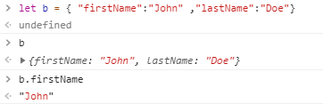
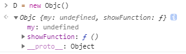
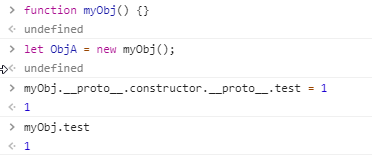

# JS面向对象编程——实际需求、公私有权、原型链、揭秘JSON真面目

> 还是很屎的语法，很难讲，但是我尽可能把它描述清楚

## 面向对象的实际需求到底在哪里呢？

教练你之前说了这么多其实我还是不大懂啊QAQ

那好吧，我们再来重新梳理一遍面向对象是一个什么样的东西

> （这里的启发来自于和CEO的一些交流内容)

* **面向过程编程** 是一种线性的，数学逻辑抽象。也就是说，你的你写的代码是你脑内已经跑过一遍的思维。

  因为这样当你的项目做大，代码量庞大很复杂，而你又很久没有接触这些代码之后，你很难记起你当时是怎么想的怎么写的，就非常的 **不易于维护**

* **面向对象编程** 是一种树状的，不只局限于数学逻辑的抽象。也就是说，你可以提前用类似自然表达的方法去 **描述(声明)** 一个类，再取得其中你所需要的一部分（比面向过程逻辑更加接近自然语言描述）。

  因为 **对象 **有一个 **继承** 关系（父子关系），同类的 **实例** 会因为类的 **声明(描述) **变化而统一变化，你不需要处处都改，而且表达更接近自然语言 **所以说易于维护**

  **举个例子** ：

  ​	开发游戏的过程当中，有反恐精英和恐怖分子两个阵营，但他们都是属于人类。他们有一样的行为：走路，跑步，发电报，投掷手雷。

  

  ## 试着用面向过程来写走路这样的行为？

  ```javascript
  //伪代码
  
  function walk(direction, player, position, isdead, isheavy, ...){
      if(isheavy == true){
          速度函数(-100)；
      }
      if(isdead == true){
          endPosition = 0;
          return endPosition;
      }
      let nowPosition = 寻找玩家位置(player);
      确定碰撞体积(player);
      地形碰撞测试(player);
      endPosition = 计算最终位置(nowPosition, position, player, direction);
      return endPosition;
  }
  ...
  ...
  function mian(){
      for(某种延迟条件){
          ...
          ...(游戏运行时需要定期刷新的的种种)
          
          if(anykey){
          	...
          	if(camp == 反恐精英){
                  ....
                  walk(direction, player, position, isdead, isheavy, ...)；
              }
          	// 同样的，恐怖分子也需要相关的功能
          	if(camp == 恐怖分子){
                  ....
                  walk(direction, player, position, isdead, isheavy, ...)；
              }
          ...
          }
        ...
      }
  	...
  } //总之就是很多很多很多代码
  ```

  ## 有什么缺点？？？

  * 时间久了之后你能确定你在代码里面的 **判断条件** 你能很明确的回忆起来吗？
  * 万一这里不是反恐精英而是求生之路呢？ 僵尸的行走会有多种不同的其他行为，你是不是要 **多写很多** **名字很长** 的函数？

很明确，这样写的代码非常难维护，噢对了，而且性能不会很好呢。复杂的逻辑判断会让cpu吃不消的。

### **有谁不在用面向对象写游戏或者大型项目吗？？？？？**

有的，挂两个不大好的例子：

* ## 太吾绘卷 (设计把程序逼跑了，自己硬写的)

* ## 泰拉瑞亚 (不是很专业小组写的小游戏，结果火了)

这两个都是 **绿皮硬核** 代码，优化都很差，源代码在网上能找到，就不提供链接了。有兴趣可以自己去找找看，虽然你们可能没听过没玩过，好吧，可能有喜欢玩steam游戏的人应该知道。


### **你没讲面向对象的代码呢！**

口述一下吧，假如有person这个 **类**，类里面放着上述代码中所判断条件的 **状态属性** ，person这个类里面有自己的 **walk方法**，不同的person实例当中可以 **继承** 来自person类的walk方法并进行其他修改，在main中只需要调用一句 `反恐精英.walk()` 就够啦，许多数据已经在你描述类的时候消化完了。

### **有趣理解和接触面向对象，感受码少趣多的网址推荐**

<https://zhuanlan.zhihu.com/p/23936161>

这里面讲了12款和编程有关的游戏，里面大部分都会用到面向对象啦~~

---

## JS面向对象中的公私有权问题和语法

#### 	简单解释公私有权和特权：

* ### **私有：爸爸不把所有钱给你，你没有爸爸的全部财产，爸爸的财产是爸爸私有的（只在自己的范围内）**

* ### **公有：爸爸是人，爸爸把他人类的DNA给了你（大家都有都知道的一小部分）**

* ### **特权：叛徒，吃里爬外，花家里的钱还告诉外面家里还剩多少钱，让大家都来花（是个内鬼）**

### **纠正上一节课程当中的问题:**

上一节课练手作业当中我讲了一个声明类并且封装函数和属性的简单方法。

```javascript
function Persion(name, age){
    this.name = name;
    this.age  = age;
    function eat(food){
        ...
    }
    function talk(words){
        ...
    }
}
        
let ceo = new Persion(ceo, 18);

ceo.eat(food); // 这个会报错诶！！！！为什么啊？？？？？
// 难道我封装的这个一点用都没有嘛？？？？？？？
```
现在我来解决大家的疑惑，因为这样封装的方法是 **私有的！！！**

也就是说内部可以访问，外部却不能，上节课我没说清楚是否要在外部调用，我只说了要你们内部调用一下封装的方法。但实际上提及使用封装的方法时，有提到：“就像普通的面向对象语法一样就可以了”。**但这句话是有误导性的，我很抱歉！**


### **一些很有趣的东西**

​	在js当中，其实 `{}` 和 `[]` 都是一个对象噢

```javascript
//在控制台中：
	typeof([]) //typeof()是一个检测类型的方法
	"object"
----------------------------------------------------------
	typeof({})
	"object"
```

也就是说我们也可以这样声明一个类

```javascript
let Birds = { //常见的静态对象声明方法
    ...
}
---------------------------------------------------------
let Person = [ //不建议随意的使用这种方法
    ...
]	// 这些都是静态类(下文会讲静态类)
```
#### 字面量？？ JSON？？VUE？？


> （受到我讲错内容的晚上CEO和留下来的几个人谈话的启发）

这堂课的标题上面写了揭秘 **JSON** 的真实面目，那么 **JSON** 到底是什么呢？

**JSON** 全称（[JavaScript](https://baike.baidu.com/item/JavaScript) Object Notation, **JS 对象简谱**）（又叫JS对象描述法）

JSON是一种特别的 **描述JS对象** 的语法——用 **字面量** 的方式来描述对象的**属性**和**方法**。

-----

##### 什么是字面量？

​	先看例子

```c++
int a;   // 变量
int b = 10;   // b为常量，10为字面量
string str = “hello！”;   // str 为变量，hello！为字面量
```

**字面量：由字母，数字等构成的字符串或者数值，它只能作为右值出现。（源代码中 “值” 的表示法）**

-----

让我们回到JSON，我们先来看回忆一下JSON的语法规则：

* 数据在名称/值对中
* 数据由逗号分隔
* 花括号保存对象
* 方括号保存数组

```JavaScript
{ 
    "firstName":"John" ,
    "lastName":"Doe"
}
// 这样的结构等价于
	firstName = "John"
	lastName = "Doe"
---------------------------------------------------------
// JSON中还可以包含数组，数组又可包含多个对象（数组本身就是对象）
{
	"employees": [
		{ 
    		"firstName":"John" ,
    		"lastName":"Doe" 
		},
		{ 
    		"firstName":"Anna" ,
    		"lastName":"Smith"
		},
		{ 
    		"firstName":"Peter" ,
    		"lastName":"Jones"
		}
	]
}
```

回忆完了JSON我们来看看JavaScript当中，如何用这种方法描述一个对象(可以动手试一试)



冒号就相当于一个‘=’

那么以后其实我们可以这样来声明一个类（这是静态类，下一个小节会说明什么是静态类）

```javascript
var user = {
  //  键:值
	init:function(name,age){
 		this.name = name;
		this.age = age;
	}, // 封装的方法1
	getName:function(){
		return this.name;
	} // 封装的方法2
}
user.init('fire子海',26);
console.log(user.getName());//output:fire子海

// 例子来自于： 
// https://www.zhangshengrong.com/p/9Oab284adK/
```

##### **不用学Vue，你听懂了上面的，就能够很直观的看懂Vue的基本使用**

```javascript
    //这里就是创建Vue对象并且将一整个()中的JSON内容传入该对象
    //Vue() 按照我们之前讲的，它是一个构造函数，对吗？
var app = new Vue({ 
  el: '#app',
  data: {
    message: 'Hello Vue!'
  }
})
```

是不是很简单呢~ （反正你看不懂不怪我啦hh）

----

### **动态类、静态类**

* 动态类：需要用关键字  `new` 实例化之后才能使用的类。

* 静态类：不需要实例化（不用new）就能用的类。（全局变量）（你可以叫它伪静态类:D）（这和别的面向对象语言不同）

  （再再吐槽：你可以把所有的JS当中的类都叫做假类，JS当中我们使用的是JS面向对象的原理，而不仅仅是面向对象的语法）

  

关于更多的 **创建类** 的方式下文中涉及原型链的时候还会讲到，但是你想知道更多的话可以去百度“JS构造器” 或者这里有些链接可以供你参考：

<http://www.w3school.com.cn/js/pro_js_object_defining.asp>

<https://segmentfault.com/a/1190000002701241>

<https://www.cnblogs.com/blackangle/p/3961352.html>

<https://www.w3cplus.com/javascript/understanding-javascript-constructors.html>

### **JS中的公私有原理**

**JS对象里面没有私有的概念，没有！！！没有！！！！真的没有！！！！！**（如果我讲错了就是有咯hhhhh）

大家可能会奇怪为什么……好吧这个我解释不了，因为JS的机制很奇怪，JS不是一个面向对象语言，它仅仅只是一个 **对象语言** ，还是当初那句话，万物皆对象。

	>只是因为对象之间可以互相的继承，所以我们可以让一个对象作为一个类来使用

```javascript
function name1(params) {
    function name2(params2) {
        
    }
} // name2外部无法调用对吗？
```

是的，name2外面无法调用（相当于私有）但是实际上name1函数内的都只作用与函数name1之内。

​								**怎么理解？**

​							**就是局部变量啊~~**

那么几种情况可以做到 方法和属性 **私有** 呢？这里举例几种（关于闭包更多的东西大家自己去网上学吧，不能再展开了，讲不完了）

​		**第一种（就是我讲错的那一种）**

​			在构造函数形成的类当中使用

```javascript
function name1(params) {
    let myvar = 12;
    function name2(params2) {
        
    }
} // 以函数声明的类一定要用new实例化噢
// name1中的myvar和name2都是私有的，因为他们都是name1的局部变量
```
​			在非构造函数的静态类当中使用

```javascript
let Obja = {
    A:function AA() {
        function isA() {
        console.log('isA!!');
        }
    }
} // 明显是访问不到isA()的啦
```

​		**第二种（闭包机制而创造的一种私有法，其实和上一种差不多）**

> 引用MDN中的话
>
> 用闭包模拟私有方法
>
> [原文网址](https://developer.mozilla.org/zh-CN/docs/Web/JavaScript/Closures#Emulating_private_methods_with_closures)
>
> 编程语言中，如 Java，是支持将方法声明为私有的，即它们只能被同一个类中的其它方法所调用。
>
> 而 JavaScript 没有这种原生支持，但我们可以使用闭包来模拟私有方法。
>
> 私有方法不仅仅有利于限制对代码的访问：还提供了管理全局命名空间的强大能力，避免非核心的方法弄乱了代码的公共接口部分。
>
> 下面的示例展现了如何使用闭包来定义公共函数，并令其可以访问私有函数和变量。这个方式也称为 模块模式（module pattern）：

```js
let Counter = (function() {
    
	let privateCounter = 0;
    
	function changeBy(val) {
		privateCounter += val;
	}
    //changeBy是一个功能型函数 是一个私有方法
	return { 
//返回的是一整个对象描述（就是在描述Counter本身）这些函数都是公共的
		increment: function() {
      					changeBy(1);
    				},
    		decrement: function() {
      					changeBy(-1);
    				},
    		value: function() {
      				return privateCounter;
    				}
		}   
})(); //Counter后面的(function)形成了一个闭包

console.log(Counter.value()); /* 输出 0 */
Counter.increment();
Counter.increment();
console.log(Counter.value()); /* 输出 2 */
Counter.decrement();
console.log(Counter.value()); /* 输出 1 */
```

> 这次我们只创建了一个词法环境，为三个函数所共享：
>
> `Counter.increment，`  `Counter.decrement`   `Counter.value`。
>
> 该共享环境创建于一个立即执行的匿名函数体内。这个环境中包含两个私有项：名为 `privateCounter` 的变量和名为 `changeBy` 的函数。这两项都无法在这个匿名函数外部直接访问。必须通过匿名函数返回的三个公共函数访问。
>
> 这三个公共函数是共享同一个环境的闭包。多亏 JavaScript 的词法作用域，它们都可以访问 `privateCounter` 变量和 `changeBy` 函数。

再看MDN官方细化的第二个例子，这里可以很好的理解到：

​					**“ 一个函数内部就是一个命名空间”**  

```js
let makeCounter = function() {
  let privateCounter = 0;
  function changeBy(val) {
    privateCounter += val;
  }
  return {
    increment: function() {
      changeBy(1);
    },
    decrement: function() {
      changeBy(-1);
    },
    value: function() {
      return privateCounter;
    }
  }  
};

var Counter1 = makeCounter();
var Counter2 = makeCounter();
console.log(Counter1.value()); /* 输出 0 */
Counter1.increment();
Counter1.increment();
console.log(Counter1.value()); /* 输出 2 */
Counter1.decrement();
console.log(Counter1.value()); /* 输出 1 */
console.log(Counter2.value()); /* 输出 0 */
//证明Counter1 和 Counter2 完全处于两个不同的空间，互不干扰
```

关于闭包的更多知识，大家还可以去看MDN的原文：https://developer.mozilla.org/zh-CN/docs/Web/JavaScript/Closures

​				（谁和我说闭包很简单啦？你学会了吗？）

关于公私有，特权问题大家可以去看这篇文章：https://www.zhangshengrong.com/p/9Oab284adK/

## JS面向对象原型链/JS面向对象原理

> （这个讲不清楚的地方就可以哈哈哈了）

这里首先要说明的是，每一个上述的创建对象 ( 类也是对象，实例也是对象，万物皆对象 ) 的方法，生成的都是一个具有 **“原型”** 的

这个 **原型** 是什么呢？是一个对象的 **子类** `__proto__` 。



**原型是一个子类？？？？？？明明 “对象D” 继承于 `__proto__` 为什么它却不是父类呢？？？**


**（这个地方我也讲不清楚，因为没法讲，这是JS的一个机制，起码现阶段没法讲）**


### **题外话**

#### 创建一个没有原型的对象

```javascript
//创建一个没有原型的对象的方法
let nullObj = Object.create(null);
//关于Object这个类的详细资料可以自行查阅MDN
```

#### 一个不怎么好笑的笑话



​	这是这个笑话一个完整的原型链：

​		ObjA → myObj ( constructor ) → Object → null

​	笑话中，继承关系是按照原型链来的，可是父子关系完全是相反的

​		ObjA ＞ myObj ( constructor ) ＞ Object ＞ null

-----

### **通过原型链操作对象**

你可以通过修改 **“原型”** 来修改已有的对象，你也可以通过修改对象 **“本身”** 来达到一样的目的。

> 本节里面的例子改自廖雪峰老师的教程，如果想更清楚的了解，请自己访问 ：<https://www.liaoxuefeng.com/wiki/001434446689867b27157e896e74d51a89c25cc8b43bdb3000/001434499763408e24c210985d34edcabbca944b4239e20000>

​	**改变**原型从而修改对象的例子：

```javascript
let Students = {
    class: 'Students',
    height: 1.2,
};

let xiaoming = {
    age:18
};

let Birds = {
    class:'Birds'
};

xiaoming.__proto__ = Students; 
//设置小明的原型为Students

console.log(xiaoming.class); //输出 Students

console.log(xiaoming.age); //输出 18
//age体现了多态，即使继承于父代，但也拥有自己的特征

xiaoming.__proto__ = Birds; 
//设置小明的原型为Birds

console.log(xiaoming.class);//输出 Birds
```

​	**修改**原型从而修改对象的例子：

```javascript
let Students = {
    class: 'Students',
    height: 1.2,
};

let xiaoming = {
    age:18
};

xiaoming.__proto__ = Students; 
//设置小明的原型为Students

console.log(xiaoming.class); //输出 Students

Students.class = 'Birds'; 

console.log(xiaoming.class);//输出 Birds
```

### **prototype 和 \__proto__ ？？？**

这里就不多讲了，这两个东西的意义类似，只是出现的场景不同，而且一般情况下建议使用 `prototype` 而不是 `__proto__` ( `__proto__` 现在还在草稿阶段，但主流浏览器早就支持 \__proto__ )

有关他们的辨析：<https://github.com/creeperyang/blog/issues/9>

**想要彻底理解原型链？ 看看廖雪峰老师的教程吧！** ：<https://www.liaoxuefeng.com/wiki/001434446689867b27157e896e74d51a89c25cc8b43bdb3000/001434499763408e24c210985d34edcabbca944b4239e20000>

这篇文章的最后有一副分析原型链的图，画的很好：<https://segmentfault.com/a/1190000002701241>

---------

### **this代表什么呢？**

`this` 是 JavaScript 语言的一个关键字。

它是函数运行时，在函数体内部自动生成的一个对象，只能在函数体内部使用。

这里只讲一点，this和面向对象有关的东西，其他的懒得讲了想知道，就看教程吧（跑）：

this 用法：http://www.ruanyifeng.com/blog/2010/04/using_this_keyword_in_javascript.html

this原理：http://www.ruanyifeng.com/blog/2018/06/javascript-this.html

上上次课程
